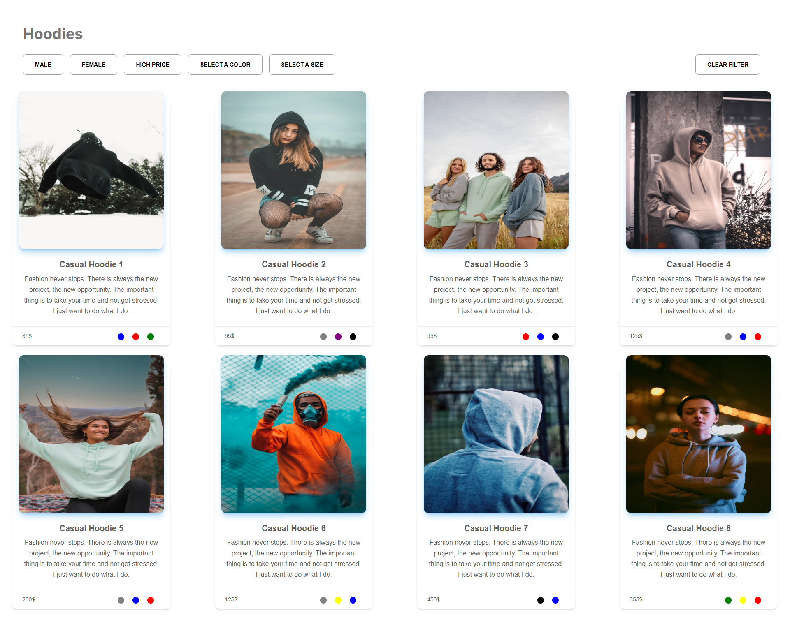

# E-commerce Project

This project is an e-commerce application developed using React. It allows users to log in or create an account and explore various product categories for shopping.

# Features:

- Login Page: Enables users to log in to the website.
- Product Categories: Includes sections for shoes, dresses, and clothing items.
- Cart Management: Allows users to add products to the cart and view details.
- Color Options: Provides color variations for products.
- Responsive Design: Optimized for both mobile and desktop devices.
- Technologies and Libraries Used:
- React: For building the user interface.
- Redux Toolkit: For state management.
- React Router: For page navigation.
- @material-tailwind/react: For user-friendly design components.
- Testing Library: For unit testing.
- Web Vitals: For performance measurement and optimization.

